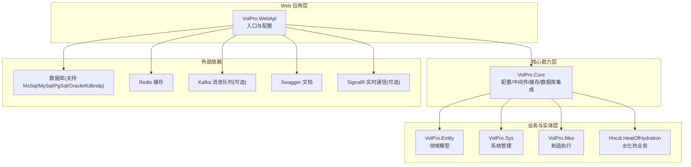
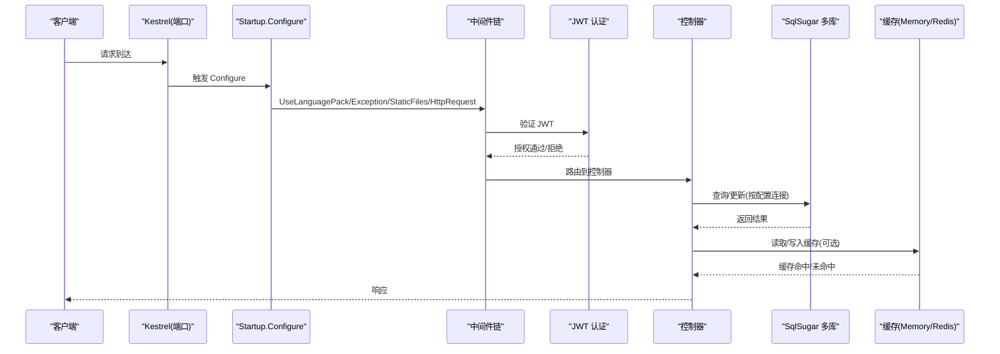
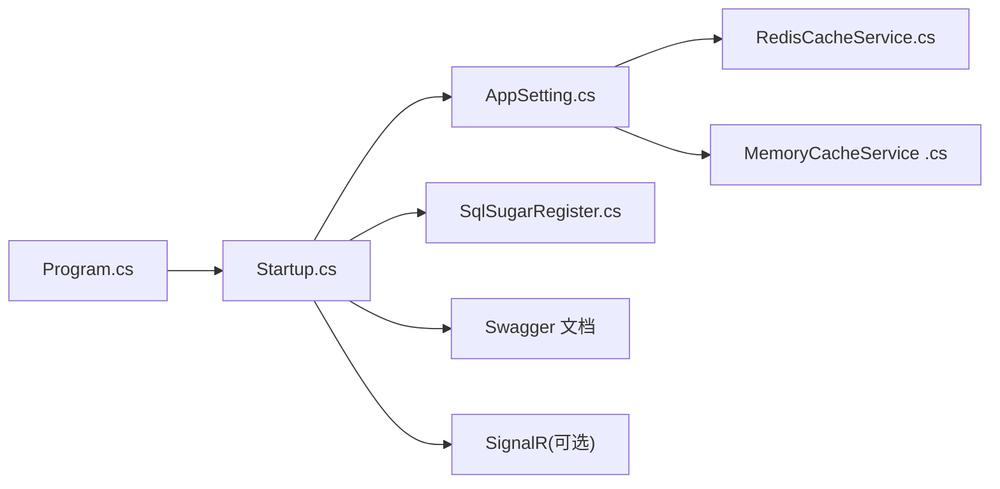

# 部署与运维

<cite>
**本文引用的文件**
- [appsettings.json](file://VolPro.WebApi/appsettings.json)
- [appsettings.Development.json](file://VolPro.WebApi/appsettings.Development.json)
- [Dockerfile](file://VolPro.WebApi/Dockerfile)
- [Program.cs](file://VolPro.WebApi/Program.cs)
- [Startup.cs](file://VolPro.WebApi/Startup.cs)
- [dev_run.bat](file://VolPro.WebApi/dev_run.bat)
- [dev_run2.bat](file://VolPro.WebApi/dev_run2.bat)
- [tmp.bat](file://VolPro.WebApi/tmp.bat)
- [launchSettings.json](file://VolPro.WebApi/Properties/launchSettings.json)
- [AppSetting.cs](file://VolPro.Core/Configuration/AppSetting.cs)
- [SqlSugarRegister.cs](file://VolPro.Core/DbSqlSugar/SqlSugarRegister.cs)
- [MemoryCacheService .cs](file://VolPro.Core/CacheManager/Service/MemoryCacheService .cs)
- [RedisCacheService.cs](file://VolPro.Core/CacheManager/Service/RedisCacheService.cs)
</cite>

## 目录
1. [简介](#简介)
2. [项目结构](#项目结构)
3. [核心组件](#核心组件)
4. [架构总览](#架构总览)
5. [详细组件分析](#详细组件分析)
6. [依赖关系分析](#依赖关系分析)
7. [性能考虑](#性能考虑)
8. [故障排查指南](#故障排查指南)
9. [结论](#结论)
10. [附录](#附录)

## 简介
本文件面向“水化热平台”的部署与运维团队，提供从开发环境到生产环境的完整落地指南，涵盖本地开发工具与环境配置、数据库与缓存设置、容器化与反向代理、SSL 证书、系统监控、日志与错误追踪、备份与灾难恢复、性能优化与容量规划，以及运维自动化与 CI/CD 建议。文档严格基于仓库现有代码与配置文件进行分析与总结，避免臆测。

## 项目结构
该工程采用多项目解决方案，Web API 层位于 VolPro.WebApi，核心能力封装于 VolPro.Core，业务实体与仓储服务分布在各功能域模块。Web API 的运行与发布配置集中在 Program.cs、Startup.cs、appsettings.*.json 与 Dockerfile 中；开发调试脚本位于 VolPro.WebApi 根目录。

图示来源
- [Program.cs:24-36](file://VolPro.WebApi/Program.cs#L24-L36)
- [Startup.cs:60-213](file://VolPro.WebApi/Startup.cs#L60-L213)
- [AppSetting.cs:85-163](file://VolPro.Core/Configuration/AppSetting.cs#L85-L163)
- [SqlSugarRegister.cs:76-131](file://VolPro.Core/DbSqlSugar/SqlSugarRegister.cs#L76-L131)

章节来源
- [Program.cs:1-39](file://VolPro.WebApi/Program.cs#L1-L39)
- [Startup.cs:1-407](file://VolPro.WebApi/Startup.cs#L1-L407)
- [appsettings.json:1-140](file://VolPro.WebApi/appsettings.json#L1-L140)

## 核心组件
- 配置中心与环境变量
  - 通过 appsettings.json 与 appsettings.Development.json 提供运行时配置，包括数据库连接、Redis、JWT、跨域、Kafka、邮件、定时任务等。
  - AppSetting 负责将配置映射为强类型对象，并在启动阶段初始化。
- 数据库与 ORM
  - 通过 SqlSugarRegister 注册多库连接，支持多种数据库类型，统一 AOP 日志输出。
- 缓存
  - 支持内存缓存与 Redis 缓存两种实现，可通过配置切换。
- 运行与发布
  - Program.cs 固定监听端口并使用 Kestrel，Startup.cs 完成中间件、认证、跨域、Swagger、SignalR、路由等装配。
  - Dockerfile 提供多阶段构建与发布镜像。

章节来源
- [AppSetting.cs:85-163](file://VolPro.Core/Configuration/AppSetting.cs#L85-L163)
- [SqlSugarRegister.cs:76-131](file://VolPro.Core/DbSqlSugar/SqlSugarRegister.cs#L76-L131)
- [MemoryCacheService .cs:1-190](file://VolPro.Core/CacheManager/Service/MemoryCacheService .cs#L1-L190)
- [RedisCacheService.cs:1-120](file://VolPro.Core/CacheManager/Service/RedisCacheService.cs#L1-L120)
- [Program.cs:24-36](file://VolPro.WebApi/Program.cs#L24-L36)
- [Startup.cs:309-382](file://VolPro.WebApi/Startup.cs#L309-L382)
- [Dockerfile:1-29](file://VolPro.WebApi/Dockerfile#L1-L29)

## 架构总览
下图展示应用启动与请求处理的关键流程，包括配置加载、中间件链路、认证授权、数据库访问与缓存交互。

图示来源
- [Program.cs:28-36](file://VolPro.WebApi/Program.cs#L28-L36)
- [Startup.cs:309-382](file://VolPro.WebApi/Startup.cs#L309-L382)
- [AppSetting.cs:85-163](file://VolPro.Core/Configuration/AppSetting.cs#L85-L163)
- [SqlSugarRegister.cs:76-131](file://VolPro.Core/DbSqlSugar/SqlSugarRegister.cs#L76-L131)

## 详细组件分析

### 开发环境搭建
- 本地开发工具
  - 使用 .NET SDK 与 Visual Studio 或 VS Code，确保安装 .NET 6 运行时与相应扩展。
  - 启动配置参考 launchSettings.json，支持 IIS Express 与裸机进程两种模式。
- 环境变量与配置
  - 在 appsettings.Development.json 中调整日志级别；生产环境使用 appsettings.json。
  - 关键配置项包括数据库连接、Redis、JWT、跨域、Kafka、邮件、定时任务等。
- 开发脚本
  - dev_run.bat 与 dev_run2.bat 提供 dotnet watch 调试方式，便于热重载开发。
  - tmp.bat 作为内部临时脚本，配合批处理日志输出。

章节来源
- [launchSettings.json:1-28](file://VolPro.WebApi/Properties/launchSettings.json#L1-L28)
- [appsettings.Development.json:1-10](file://VolPro.WebApi/appsettings.Development.json#L1-L10)
- [dev_run.bat:1-20](file://VolPro.WebApi/dev_run.bat#L1-L20)
- [dev_run2.bat:1-3](file://VolPro.WebApi/dev_run2.bat#L1-L3)
- [tmp.bat:1-2](file://VolPro.WebApi/tmp.bat#L1-L2)

### 生产环境部署策略
- 容器化部署
  - Dockerfile 已配置多阶段构建，发布产物复制至最终镜像，入口为 VolPro.WebApi.dll。
  - 容器暴露端口需与 Program.cs 中 Kestrel 监听端口一致。
- 反向代理与 SSL
  - 建议在 Nginx/Tengine 前置反向代理，将 HTTPS 终止于前置，转发至容器内应用端口。
  - SSL 证书由前置统一管理与续期，容器内无需直接处理证书。
- 环境变量与配置
  - 通过挂载卷或环境变量注入 appsettings.json 内容，避免硬编码敏感信息。
  - 建议将数据库连接、Redis、JWT 密钥、Kafka 凭据等放入密钥管理服务。

章节来源
- [Dockerfile:1-29](file://VolPro.WebApi/Dockerfile#L1-L29)
- [Program.cs:28-36](file://VolPro.WebApi/Program.cs#L28-L36)
- [appsettings.json:1-140](file://VolPro.WebApi/appsettings.json#L1-L140)

### 系统监控方案
- 应用性能监控
  - 使用 ASP.NET Core 内置指标与日志，结合第三方 APM（如 Prometheus + Grafana）采集请求耗时、吞吐、错误率。
  - 启用 Swagger 便于接口级健康检查与压测验证。
- 数据库性能监控
  - SqlSugar AOP 已输出 SQL 日志，建议接入数据库慢查询日志与执行计划分析。
  - 对热点查询建立索引与读写分离，必要时引入只读副本。
- 系统资源监控
  - 监控 CPU、内存、磁盘 IO、网络带宽；容器场景下关注容器边界资源限制与突发带宽。
  - 结合操作系统监控工具与日志聚合平台统一告警。

章节来源
- [Startup.cs:133-169](file://VolPro.WebApi/Startup.cs#L133-L169)
- [SqlSugarRegister.cs:110-126](file://VolPro.Core/DbSqlSugar/SqlSugarRegister.cs#L110-L126)

### 日志管理与分析
- 日志级别
  - 开发环境默认日志级别为 Information，可在 appsettings.Development.json 调整。
- 错误追踪
  - 异常中间件已在 Startup 中注册，统一拦截异常并返回 JSON 响应。
  - 建议接入结构化日志（如 Serilog/Seq/Elastic Stack），实现关键字检索与聚合分析。
- 静态文件与上传目录
  - Startup 中已配置静态文件与 Upload 目录，确保日志与上传文件具备持久化存储与轮转策略。

章节来源
- [appsettings.Development.json:1-10](file://VolPro.WebApi/appsettings.Development.json#L1-L10)
- [Startup.cs:321-350](file://VolPro.WebApi/Startup.cs#L321-L350)

### 备份与灾难恢复
- 数据库备份
  - 建议按天/周/月制定全量与增量备份策略，备份介质落盘至专用磁盘或对象存储。
  - 针对动态分库场景，确保每个业务库均纳入备份范围。
- 配置与密钥
  - 将 appsettings.json 中敏感配置（数据库、Redis、JWT、Kafka）纳入密管与版本控制隔离。
- 灾难恢复演练
  - 定期进行 RTO/RPO 测试，验证备份恢复流程与数据一致性。

章节来源
- [appsettings.json:16-139](file://VolPro.WebApi/appsettings.json#L16-L139)
- [SqlSugarRegister.cs:84-99](file://VolPro.Core/DbSqlSugar/SqlSugarRegister.cs#L84-L99)

### 性能优化与容量规划
- 数据库层面
  - 优化热点表索引与查询计划，减少 N+1 查询；对大表分页与分片。
  - 合理设置连接池大小与超时时间，避免连接泄漏。
- 缓存策略
  - 对高频读取数据使用 Redis 缓存，设置合理过期策略；对写多读少场景采用写穿透或延迟双删。
  - 当 UseRedis=false 时，使用内存缓存，注意集群共享与序列化开销。
- 应用层面
  - 控制请求体大小与并发，避免大文件上传阻塞；对批量导入/导出使用异步与流式处理。
  - 启用压缩与静态资源缓存，减少网络传输。

章节来源
- [AppSetting.cs:27-34](file://VolPro.Core/Configuration/AppSetting.cs#L27-L34)
- [MemoryCacheService .cs:1-190](file://VolPro.Core/CacheManager/Service/MemoryCacheService .cs#L1-L190)
- [RedisCacheService.cs:1-120](file://VolPro.Core/CacheManager/Service/RedisCacheService.cs#L1-L120)
- [Startup.cs:192-206](file://VolPro.WebApi/Startup.cs#L192-L206)

### 运维自动化与 CI/CD
- 构建与发布
  - 使用 Dockerfile 进行多阶段构建，发布到镜像仓库；结合编排平台（如 Kubernetes）进行滚动升级与回滚。
- 配置管理
  - 将 appsettings.json 与敏感配置通过环境变量或密钥管理注入容器，避免硬编码。
- 监控与告警
  - 集成日志、指标与链路追踪，设置阈值告警与自动扩缩容策略。
- 自动化脚本
  - 可复用 dev_run*.bat 作为本地调试模板，生产环境使用 systemd/docker-compose 管理生命周期。

章节来源
- [Dockerfile:1-29](file://VolPro.WebApi/Dockerfile#L1-L29)
- [dev_run.bat:1-20](file://VolPro.WebApi/dev_run.bat#L1-L20)
- [dev_run2.bat:1-3](file://VolPro.WebApi/dev_run2.bat#L1-L3)

## 依赖关系分析
- 组件耦合
  - Web API 依赖 Core 提供的配置、中间件、缓存与数据库集成；Core 再依赖 Entity 与各业务模块。
- 外部依赖
  - 数据库：MsSql/MySql/PgSql/Oracle/Kdbndp；缓存：Redis；消息：Kafka；实时通信：SignalR；文档：Swagger。
- 配置与运行时
  - AppSetting 在启动时解析配置并加密解密敏感字段；SqlSugarRegister 注册多库连接与 AOP 日志。

图示来源
- [Program.cs:24-36](file://VolPro.WebApi/Program.cs#L24-L36)
- [Startup.cs:60-213](file://VolPro.WebApi/Startup.cs#L60-L213)
- [AppSetting.cs:85-163](file://VolPro.Core/Configuration/AppSetting.cs#L85-L163)
- [SqlSugarRegister.cs:76-131](file://VolPro.Core/DbSqlSugar/SqlSugarRegister.cs#L76-L131)
- [RedisCacheService.cs:1-120](file://VolPro.Core/CacheManager/Service/RedisCacheService.cs#L1-L120)
- [MemoryCacheService .cs:1-190](file://VolPro.Core/CacheManager/Service/MemoryCacheService .cs#L1-L190)

章节来源
- [Program.cs:1-39](file://VolPro.WebApi/Program.cs#L1-L39)
- [Startup.cs:1-407](file://VolPro.WebApi/Startup.cs#L1-L407)
- [AppSetting.cs:1-237](file://VolPro.Core/Configuration/AppSetting.cs#L1-L237)
- [SqlSugarRegister.cs:1-155](file://VolPro.Core/DbSqlSugar/SqlSugarRegister.cs#L1-L155)

## 性能考虑
- 数据库访问
  - 利用 SqlSugar 的 AOP 日志定位慢 SQL；对高频查询建立复合索引与物化视图。
- 缓存命中
  - 合理设置过期时间与淘汰策略，避免缓存雪崩；对热点数据预热。
- 网络与 I/O
  - 控制请求体大小与并发连接数；对静态资源启用 CDN 与浏览器缓存。
- 容器资源
  - 设置 CPU/内存限额与探针，避免资源争抢导致抖动。

## 故障排查指南
- 启动失败
  - 检查 appsettings.json 中数据库连接、Redis、JWT、跨域配置是否正确；确认端口未被占用。
- 认证失败
  - 核对 JWT Issuer/Audience 与密钥；确认前端携带正确的 Authorization 头。
- 数据库异常
  - 查看 SqlSugar AOP 输出的 SQL 与参数；核对连接字符串与数据库实例状态。
- 缓存问题
  - 若使用 Redis，确认连接字符串与网络连通性；若使用内存缓存，检查序列化与过期策略。
- 日志与错误
  - 启用详细日志级别，结合异常中间件响应定位问题；对静态文件访问失败检查 Upload 目录权限。

章节来源
- [Startup.cs:84-114](file://VolPro.WebApi/Startup.cs#L84-L114)
- [Startup.cs:321-350](file://VolPro.WebApi/Startup.cs#L321-L350)
- [SqlSugarRegister.cs:110-126](file://VolPro.Core/DbSqlSugar/SqlSugarRegister.cs#L110-L126)
- [AppSetting.cs:148-161](file://VolPro.Core/Configuration/AppSetting.cs#L148-L161)

## 结论
本文基于仓库现有代码与配置，给出了从开发到生产的完整运维蓝图：明确的配置体系、可扩展的数据库与缓存层、标准化的容器化与发布流程、完善的监控与日志策略、以及可落地的备份与灾备建议。建议在实际生产中结合自身基础设施与合规要求进一步细化与加固。

## 附录
- 快速对照清单
  - 确认 appsettings.json 中数据库、Redis、JWT、跨域、Kafka、邮件、定时任务等配置齐全。
  - 确认 Program.cs 与 Dockerfile 中端口一致，容器镜像构建与发布流程可用。
  - 确认 Nginx 前置代理与 SSL 证书配置正确，容器内仅暴露必要端口。
  - 建立日志、指标与告警体系，定期演练备份与恢复。