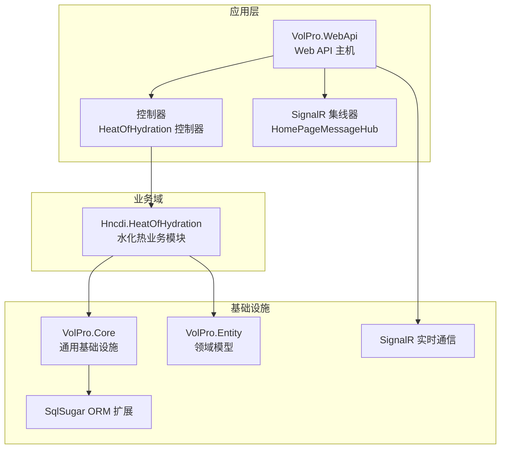
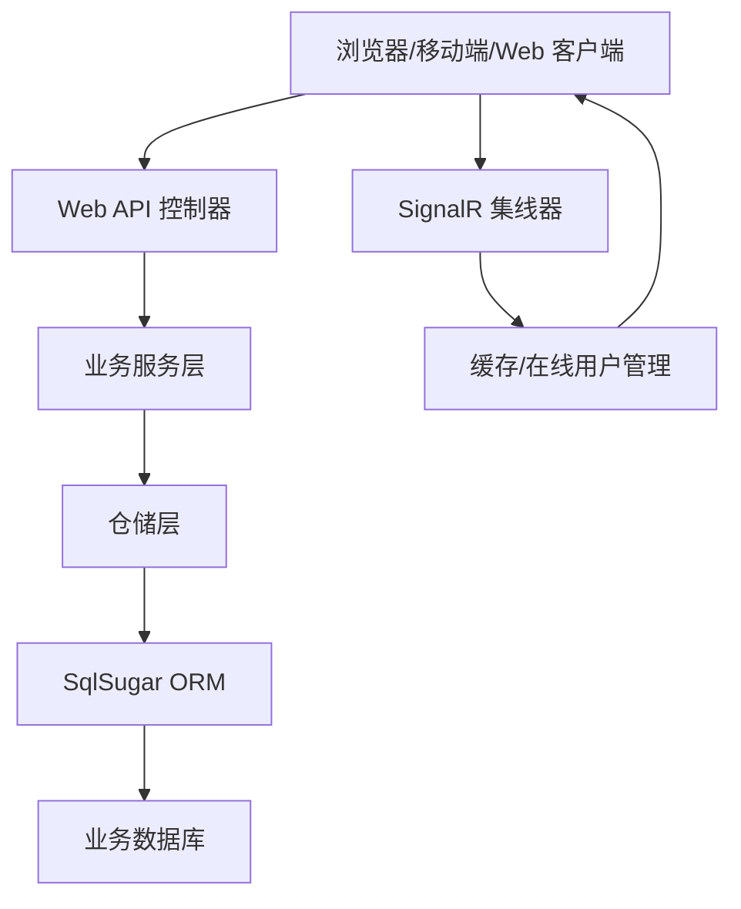
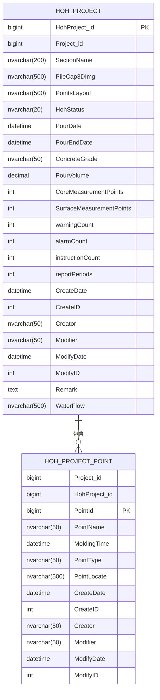
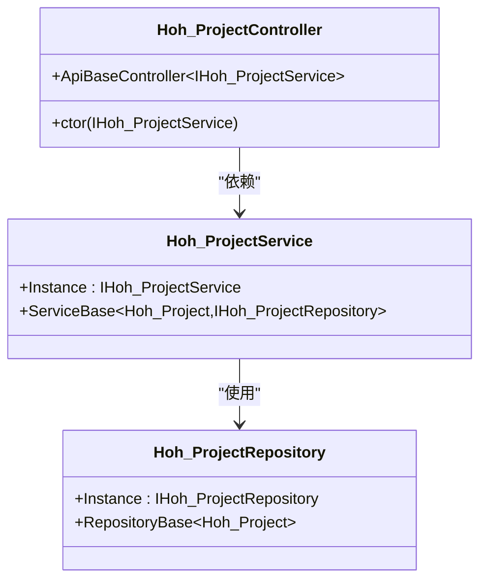
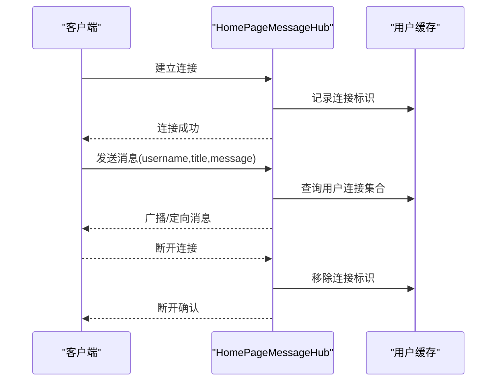
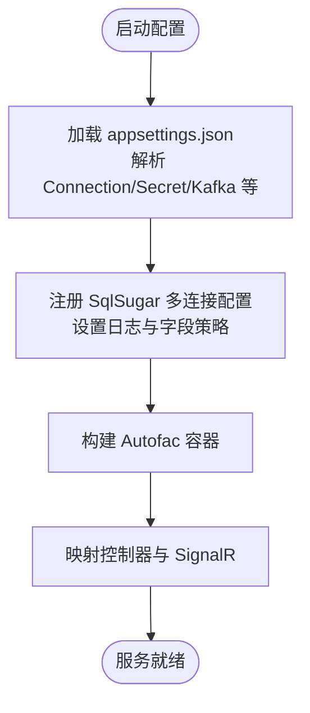
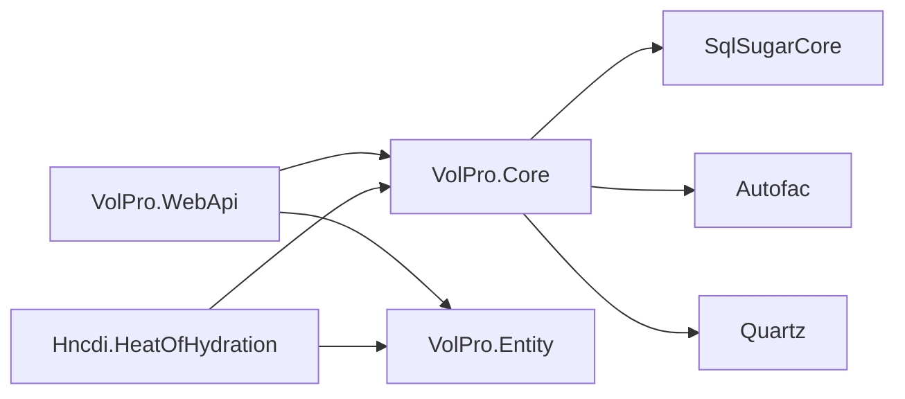

# 项目概述

<cite>
**本文引用的文件**
- [Program.cs](file://VolPro.WebApi/Program.cs)
- [Startup.cs](file://VolPro.WebApi/Startup.cs)
- [Hoh_Project.cs](file://VolPro.Entity/DomainModels/Hoh/Hoh_Project.cs)
- [Hoh_Project_Point.cs](file://VolPro.Entity/DomainModels/Hoh/Hoh_Project_Point.cs)
- [Hoh_ProjectController.cs](file://VolPro.WebApi/Controllers/HeatOfHydration/Hoh_ProjectController.cs)
- [HomePageMessageHub.cs](file://VolPro.WebApi/Controllers/Hubs/HomePageMessageHub.cs)
- [SqlSugarRegister.cs](file://VolPro.Core/DbSqlSugar/SqlSugarRegister.cs)
- [AppSetting.cs](file://VolPro.Core/Configuration/AppSetting.cs)
- [VolPro.Core.csproj](file://VolPro.Core/VolPro.Core.csproj)
- [VolPro.Entity.csproj](file://VolPro.Entity/VolPro.Entity.csproj)
- [Hncdi.HeatOfHydration.csproj](file://Hncdi.HeatOfHydration/Hncdi.HeatOfHydration.csproj)
- [appsettings.json](file://VolPro.WebApi/appsettings.json)
</cite>

## 目录
1. [引言](#引言)
2. [项目结构](#项目结构)
3. [核心组件](#核心组件)
4. [架构总览](#架构总览)
5. [详细组件分析](#详细组件分析)
6. [依赖分析](#依赖分析)
7. [性能考虑](#性能考虑)
8. [故障排查指南](#故障排查指南)
9. [结论](#结论)
10. [附录](#附录)

## 引言
本项目为“水化热平台”，面向工业监控领域，聚焦混凝土水化热监测与预警，提供从数据采集、存储、分析到实时告警与可视化展示的一体化能力。项目采用分层架构与模块化设计，结合 .NET 8.0、ASP.NET Core、SqlSugar ORM、SignalR 等技术栈，实现高可用、可扩展、易维护的工业级监控系统。其业务价值在于通过实时数据驱动与可视化手段，辅助工程人员及时发现并处置温度异常，降低结构裂缝风险，提升工程质量与安全水平。

## 项目结构
项目采用多项目解决方案组织，按职责划分为 Web 应用层、核心基础层、实体模型层、业务服务层与具体业务域模块。核心目录与职责如下：
- VolPro.WebApi：ASP.NET Core Web API 主机，负责路由、中间件、认证授权、Swagger 文档、SignalR 集线器与业务控制器入口。
- VolPro.Core：通用基础设施与工具集，包含依赖注入、ORM 扩展、缓存、语言包、中间件、工作流、打印、定时任务等。
- VolPro.Entity：领域模型与系统公共模型，承载水化热相关实体及系统表结构。
- Hncdi.HeatOfHydration：水化热业务域模块，封装水化热项目、测点、子数据与报表等领域的仓储与服务。
- 其他模块（如 VolPro.Sys、VolPro.Mes 等）提供系统管理、MES 等通用能力，便于统一集成。

图表来源
- [Program.cs:1-39](file://VolPro.WebApi/Program.cs#L1-L39)
- [Startup.cs:1-407](file://VolPro.WebApi/Startup.cs#L1-L407)
- [Hoh_ProjectController.cs:1-22](file://VolPro.WebApi/Controllers/HeatOfHydration/Hoh_ProjectController.cs#L1-L22)
- [HomePageMessageHub.cs:1-99](file://VolPro.WebApi/Controllers/Hubs/HomePageMessageHub.cs#L1-L99)
- [SqlSugarRegister.cs:1-155](file://VolPro.Core/DbSqlSugar/SqlSugarRegister.cs#L1-L155)

章节来源
- [Program.cs:1-39](file://VolPro.WebApi/Program.cs#L1-L39)
- [Startup.cs:1-407](file://VolPro.WebApi/Startup.cs#L1-L407)

## 核心组件
- Web API 主机与启动配置：负责 Kestrel 监听、认证授权、CORS、Swagger、SignalR、SqlSugar 注册与中间件链路装配。
- 水化热实体模型：涵盖“监控部位”“监控点位”等核心业务实体，标注数据库映射与中文注释，支撑业务查询与报表。
- 控制器与集线器：提供 REST 接口与实时消息通道，支持前后端交互与在线状态管理。
- ORM 扩展：集中注册多数据库连接、日志拦截与字段命名策略，统一业务库配置。
- 配置中心：集中管理数据库、Redis、JWT、CORS、Kafka、定时任务等全局配置。

章节来源
- [Hoh_Project.cs:1-230](file://VolPro.Entity/DomainModels/Hoh/Hoh_Project.cs#L1-L230)
- [Hoh_Project_Point.cs:1-138](file://VolPro.Entity/DomainModels/Hoh/Hoh_Project_Point.cs#L1-L138)
- [Hoh_ProjectController.cs:1-22](file://VolPro.WebApi/Controllers/HeatOfHydration/Hoh_ProjectController.cs#L1-L22)
- [HomePageMessageHub.cs:1-99](file://VolPro.WebApi/Controllers/Hubs/HomePageMessageHub.cs#L1-L99)
- [SqlSugarRegister.cs:76-131](file://VolPro.Core/DbSqlSugar/SqlSugarRegister.cs#L76-L131)
- [AppSetting.cs:85-163](file://VolPro.Core/Configuration/AppSetting.cs#L85-L163)

## 架构总览
系统采用分层与模块化混合架构：
- 表现层：ASP.NET Core MVC/Controllers + SignalR 集线器，提供 REST API 与实时消息。
- 领域层：实体模型与业务服务，封装业务规则与流程。
- 基础设施层：ORM、缓存、中间件、认证授权、定时任务、打印、工作流等。
- 数据访问层：基于 SqlSugar 的仓储实现，支持多数据库与连接池配置。
- 部署与运行：Kestrel 作为 Web 服务器，Autofac 作为 DI 容器，支持 Swagger 文档与 CORS 跨域。

图表来源
- [Startup.cs:309-382](file://VolPro.WebApi/Startup.cs#L309-L382)
- [SqlSugarRegister.cs:76-131](file://VolPro.Core/DbSqlSugar/SqlSugarRegister.cs#L76-L131)
- [HomePageMessageHub.cs:20-99](file://VolPro.WebApi/Controllers/Hubs/HomePageMessageHub.cs#L20-L99)

## 详细组件分析

### 组件一：水化热实体模型
- Hoh_Project：监控部位实体，包含部位名称、三维图、测点布置图、浇筑状态与时间、混凝土标号、方量、预警/报警/指令次数、报表期数、创建与修改信息等字段，标注数据库表名与中文注释，便于代码生成与 UI 映射。
- Hoh_Project_Point：监控点位实体，包含所属项目与部位、点位名称、入模时间、类型、位置与备注等，支持多测点管理与关联统计。

图表来源
- [Hoh_Project.cs:17-229](file://VolPro.Entity/DomainModels/Hoh/Hoh_Project.cs#L17-L229)
- [Hoh_Project_Point.cs:17-137](file://VolPro.Entity/DomainModels/Hoh/Hoh_Project_Point.cs#L17-L137)

章节来源
- [Hoh_Project.cs:1-230](file://VolPro.Entity/DomainModels/Hoh/Hoh_Project.cs#L1-L230)
- [Hoh_Project_Point.cs:1-138](file://VolPro.Entity/DomainModels/Hoh/Hoh_Project_Point.cs#L1-L138)

### 组件二：控制器与业务服务
- Hoh_ProjectController：基于 ApiBaseController 与权限表注解，提供水化热项目实体的增删改查与权限控制，路由前缀为 api/Hoh_Project。
- Hoh_ProjectService：继承 ServiceBase，封装业务逻辑；通过 Autofac 获取实例，确保依赖注入与生命周期管理。
- Hoh_ProjectRepository：继承 RepositoryBase，基于 ServiceDbContext 提供仓储能力，支持多数据库连接与事务。

图表来源
- [Hoh_ProjectController.cs:11-19](file://VolPro.WebApi/Controllers/HeatOfHydration/Hoh_ProjectController.cs#L11-L19)
- [Hncdi.HeatOfHydration/Services/Hoh/Hoh_ProjectService.cs:16-23](file://Hncdi.HeatOfHydration/Services/Hoh/Hoh_ProjectService.cs#L16-L23)
- [Hncdi.HeatOfHydration/Repositories/Hoh/Hoh_ProjectRepository.cs:13-23](file://Hncdi.HeatOfHydration/Repositories/Hoh/Hoh_ProjectRepository.cs#L13-L23)

章节来源
- [Hoh_ProjectController.cs:1-22](file://VolPro.WebApi/Controllers/HeatOfHydration/Hoh_ProjectController.cs#L1-L22)
- [Hncdi.HeatOfHydration/Services/Hoh/Hoh_ProjectService.cs:1-24](file://Hncdi.HeatOfHydration/Services/Hoh/Hoh_ProjectService.cs#L1-L24)
- [Hncdi.HeatOfHydration/Repositories/Hoh/Hoh_ProjectRepository.cs:1-25](file://Hncdi.HeatOfHydration/Repositories/Hoh/Hoh_ProjectRepository.cs#L1-L25)

### 组件三：实时通信与在线用户管理
- HomePageMessageHub：基于 SignalR 的集线器，负责连接建立/断开、用户上下线状态维护与定向消息推送，支持跨域配置与凭据传递。

图表来源
- [HomePageMessageHub.cs:39-96](file://VolPro.WebApi/Controllers/Hubs/HomePageMessageHub.cs#L39-L96)
- [Startup.cs:366-382](file://VolPro.WebApi/Startup.cs#L366-L382)

章节来源
- [HomePageMessageHub.cs:1-99](file://VolPro.WebApi/Controllers/Hubs/HomePageMessageHub.cs#L1-L99)
- [Startup.cs:309-382](file://VolPro.WebApi/Startup.cs#L309-L382)

### 组件四：ORM 集成与数据库配置
- SqlSugarRegister：集中注册多数据库连接配置，支持业务库日志拦截、字段命名策略与外部服务配置，统一 SqlSugarScope 生命周期。
- AppSetting：集中加载 appsettings.json 中的连接串、JWT、CORS、Redis、Kafka、定时任务等配置，支持 DES 解密与运行时切换。

图表来源
- [SqlSugarRegister.cs:76-131](file://VolPro.Core/DbSqlSugar/SqlSugarRegister.cs#L76-L131)
- [AppSetting.cs:85-163](file://VolPro.Core/Configuration/AppSetting.cs#L85-L163)
- [appsettings.json:16-57](file://VolPro.WebApi/appsettings.json#L16-L57)

章节来源
- [SqlSugarRegister.cs:1-155](file://VolPro.Core/DbSqlSugar/SqlSugarRegister.cs#L1-L155)
- [AppSetting.cs:1-237](file://VolPro.Core/Configuration/AppSetting.cs#L1-L237)
- [appsettings.json:1-140](file://VolPro.WebApi/appsettings.json#L1-L140)

## 依赖分析
- 技术栈与版本：
  - .NET 8.0：目标框架与运行时。
  - ASP.NET Core：Web API、SignalR、Swagger、认证授权、CORS。
  - SqlSugarCore：ORM 核心能力与多数据库支持。
  - Autofac：容器与模块化注册。
  - Quartz：定时任务调度。
  - EPPlus、Npgsql、System.IdentityModel.Tokens.Jwt 等：辅助能力。
- 项目间依赖：
  - Hncdi.HeatOfHydration 依赖 VolPro.Core 与 VolPro.Entity。
  - VolPro.WebApi 依赖 VolPro.Core，控制器引用水化热业务服务接口。
  - VolPro.Core 依赖 VolPro.Entity，并引入 SqlSugarCore、Autofac、Quartz 等。

图表来源
- [Hncdi.HeatOfHydration.csproj:9-12](file://Hncdi.HeatOfHydration/Hncdi.HeatOfHydration.csproj#L9-L12)
- [VolPro.Core.csproj:24-66](file://VolPro.Core/VolPro.Core.csproj#L24-L66)
- [VolPro.Entity.csproj:26-30](file://VolPro.Entity/VolPro.Entity.csproj#L26-L30)

章节来源
- [VolPro.Core.csproj:1-73](file://VolPro.Core/VolPro.Core.csproj#L1-L73)
- [VolPro.Entity.csproj:1-40](file://VolPro.Entity/VolPro.Entity.csproj#L1-L40)
- [Hncdi.HeatOfHydration.csproj:1-15](file://Hncdi.HeatOfHydration/Hncdi.HeatOfHydration.csproj#L1-L15)

## 性能考虑
- 数据库连接与日志：通过 SqlSugar 注册集中管理连接与日志拦截，便于性能观测与问题定位。
- 缓存策略：支持 Redis 或内存缓存，建议对热点查询与报表结果进行缓存，降低数据库压力。
- SignalR：合理设置连接数与消息广播范围，避免大规模无差别推送。
- 定时任务：使用 Quartz 管理周期性任务，避免阻塞主线程，确保任务执行幂等与失败重试。
- 跨域与认证：CORS 与 JWT 配置需与前端保持一致，减少握手失败与重复请求。

## 故障排查指南
- 启动与端口
  - 确认 Kestrel 监听地址与端口配置，检查防火墙与反向代理设置。
- 认证与授权
  - 检查 appsettings.json 中的 Secret（JWT、Audience、Issuer）与 CorsUrls，确保前端域名匹配。
- 数据库连接
  - 核对 Connection 节点中的 DBType、连接串与 UseRedis/UseSignalR 等开关。
- ORM 日志
  - 观察 OnLogExecuting 输出，定位慢查询与异常 SQL。
- SignalR
  - 检查 MapHub 路由与跨域策略，确认客户端连接 URL 与凭据传递。

章节来源
- [Program.cs:24-36](file://VolPro.WebApi/Program.cs#L24-L36)
- [Startup.cs:84-130](file://VolPro.WebApi/Startup.cs#L84-L130)
- [appsettings.json:58-68](file://VolPro.WebApi/appsettings.json#L58-L68)
- [SqlSugarRegister.cs:110-126](file://VolPro.Core/DbSqlSugar/SqlSugarRegister.cs#L110-L126)
- [Startup.cs:366-382](file://VolPro.WebApi/Startup.cs#L366-L382)

## 结论
水化热平台以清晰的分层与模块化设计为基础，结合 .NET 8.0 与 SqlSugar ORM、SignalR 等关键技术，构建了面向工业监控场景的高可用系统。通过实体模型与控制器/服务/仓储的协同，实现了从数据采集到实时告警与可视化的完整闭环。建议在生产环境中完善缓存、限流与可观测性配置，持续优化数据库与任务调度策略，以满足更高并发与稳定性要求。

## 附录
- 快速启动要点
  - 配置 appsettings.json 中的数据库连接与跨域地址。
  - 启动 Web API，访问 Swagger 查看接口文档。
  - 前端通过 SignalR 连接 /message，接收实时消息。
- 开发建议
  - 使用 Partial 文件扩展业务逻辑，避免代码生成覆盖。
  - 对高频查询与报表结果进行缓存与分页优化。
  - 为关键业务流程补充单元测试与集成测试。